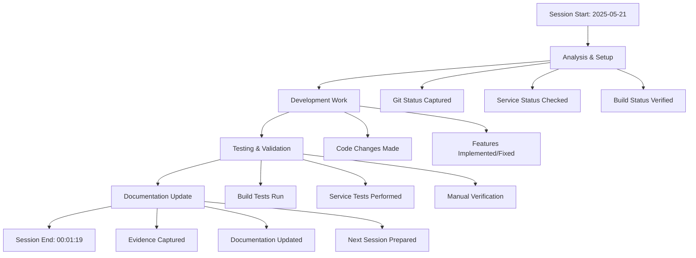

# Session Summary - 2025-05-21 (Session 4)

## Project: Claude_MCPServer
- **Branch**: main  
- **Session Number**: 4
- **Date**: 2025-05-21
- **Time**: 00:01:19
- **Last Commit**: fa15f3a - feat: complete database foundation with enterprise-grade architecture

## Files Modified in This Session

### Staged Files
```

```

### Unstaged Files  
```

```

### All Modified Files
```

```

## Session Workflow


## Evidence Generated
- 📊 Git context and changes
- 🔨 Build and test results  
- 🚀 Service status and responses
- 📸 Screenshots of current state
- 📝 Complete session documentation

## Build/Test Status at Session End
Build Results: See [session build results](../command_outputs/build/session_build_results.md)
- ❌ Build: FAILED or not available
- ❌ Tests: FAILING or not available

## Service Status at Session End
Service Status: See [session service status](../command_outputs/services/session_end_services.md)
- Running Services: 0
0 detected
