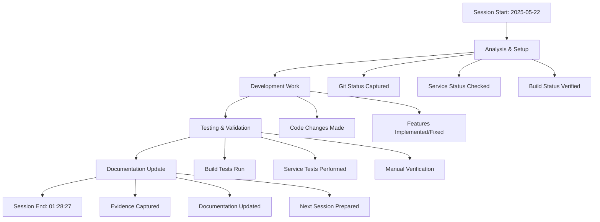

# Session Summary - 2025-05-22 (Session 4)

## Project: Claude_MCPServer
- **Branch**: main  
- **Session Number**: 4
- **Date**: 2025-05-22
- **Time**: 01:28:27
- **Last Commit**: e4fddd9 - Commit v4 20250521 Claude Code Changes for Enterprise Ready

## Files Modified in This Session

### Staged Files
```

```

### Unstaged Files  
```
SESSION_NOTES.md
UPDATE_DOCS_COMMAND.md
config/claude-desktop/claude_desktop_config.json
docs/command_outputs/git/session_end_status.md
docs/command_outputs/services/session_end_services.md
docs/diagrams/session_summary_2025-05-21.md
mcp/memory/server.js
package.json
servers/ai-integration/src/ensemble-methods.ts
servers/data-analytics/src/data-governance.ts
servers/data-analytics/src/data-pipeline.ts
servers/data-analytics/src/data-warehouse.ts
servers/data-analytics/src/ml-deployment.ts
servers/data-analytics/src/realtime-analytics.ts
```

### All Modified Files
```
SESSION_NOTES.md
UPDATE_DOCS_COMMAND.md
config/claude-desktop/claude_desktop_config.json
docs/command_outputs/git/session_end_status.md
docs/command_outputs/services/session_end_services.md
docs/diagrams/session_summary_2025-05-21.md
mcp/memory/server.js
package.json
servers/ai-integration/src/ensemble-methods.ts
servers/data-analytics/src/data-governance.ts
servers/data-analytics/src/data-pipeline.ts
servers/data-analytics/src/data-warehouse.ts
servers/data-analytics/src/ml-deployment.ts
servers/data-analytics/src/realtime-analytics.ts
```

## Session Workflow


## Evidence Generated
- 📊 Git context and changes
- 🔨 Build and test results  
- 🚀 Service status and responses
- 📸 Screenshots of current state
- 📝 Complete session documentation

## Build/Test Status at Session End
Build Results: See [session build results](../command_outputs/build/session_build_results.md)
- ❌ Build: FAILED or not available
- ❌ Tests: FAILING or not available

## Service Status at Session End
Service Status: See [session service status](../command_outputs/services/session_end_services.md)
- Running Services: 0
0 detected
